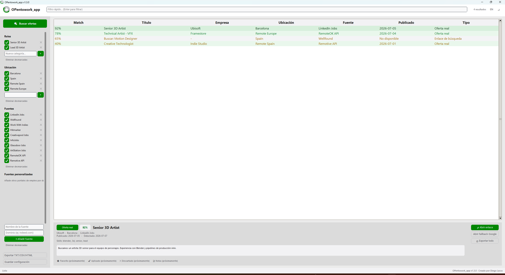

# OPentowork_app

Aplicación de escritorio en Python (CustomTkinter) para buscar ofertas de empleo combinando enlaces de búsqueda directos y APIs públicas, con un sistema de match por keywords y roles.



## Características

- **Roles, ubicaciones, fuentes y keywords** totalmente configurables desde la barra lateral, con puntuación de match (0-100%) por oferta.
- **Fuentes personalizadas**: añade cualquier portal de empleo por nombre + dominio, sin tocar código.
- **Tabla de resultados** con color por tipo (oferta real vs. enlace de búsqueda) y por score de match.
- **Panel de detalle** con descripción, skills detectadas, y accesos directos para abrir el enlace o el fallback de Google.
- **Exportación** a TXT, CSV y HTML.
- **Modo claro/oscuro** y **selector de idioma español/inglés**, ambos en caliente.
- Integraciones ya incluidas: LinkedIn, Wellfound, Work With Indies, Hitmarker, Creativepool, InfoJobs, Glassdoor, ArtStation, RemoteOK API y Remotive API.

## Instalación

```bash
python -m pip install -r requirements.txt
python opentowork_app.py
```

## Generar el ejecutable (.exe)

```bash
python -m PyInstaller OPentowork_app.spec --noconfirm
```

o usando el script incluido:

```bash
build_exe_opentowork_app.bat
```

El `.exe` queda en `dist/OPentowork_app.exe`.

## Dónde se guardan tus datos

- Configuración: `%APPDATA%\OPentowork_app\config.json`
- Resultados exportados: `%APPDATA%\OPentowork_app\results\`
- Logs: `%APPDATA%\OPentowork_app\logs\opentowork_app.log`

## Estructura del proyecto

```
opentowork_app.py       # Punto de entrada
constants.py             # Nombre, versión, valores por defecto
i18n.py                  # Textos en español/inglés
core/                    # Lógica: scoring, fuentes, export, config, logging
ui/                      # Interfaz CustomTkinter
assets/                  # Logo e icono
```

## Autor

Creado por **Diego Lasso**.
