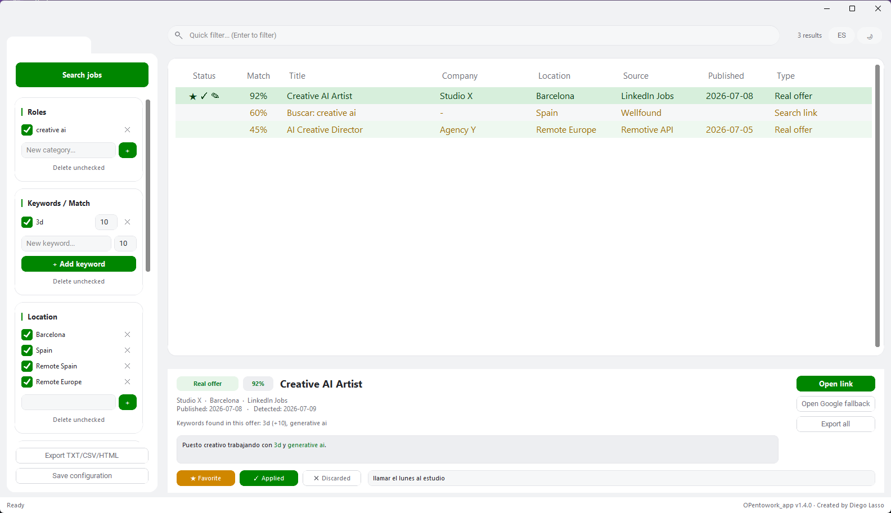

# OpenToWork 

Aplicación de escritorio en Python (CustomTkinter) para buscar ofertas de empleo combinando enlaces de búsqueda directos y APIs públicas, con un sistema de match por keywords y roles.



## Características

- **Roles, ubicaciones, fuentes y keywords** totalmente configurables desde la barra lateral, con puntuación de match (0-100%) por oferta.
- **Fuentes personalizadas**: añade cualquier portal de empleo por nombre + dominio, sin tocar código.
- **Tabla de resultados** con color por tipo (oferta real vs. enlace de búsqueda) y por score de match.
- **Panel de detalle** con descripción (keywords resaltadas), y accesos directos para abrir el enlace o el fallback de Google.
- **Seguimiento por oferta**: marca ★ Favorito, ✓ Aplicado o ✕ Descartado y escribe notas propias — persiste entre sesiones y se ve de un vistazo en la columna Estado.
- **Exportación** a TXT, CSV y HTML.
- **Modo claro/oscuro** y **selector de idioma español/inglés**, ambos en caliente.
- **Paneles redimensionables**: arrastra los divisores entre buscador, tabla y detalle.
- **43 fuentes incluidas por defecto** organizadas en 6 categorías plegables: 35 portales por dominio y 8 APIs con ofertas reales dentro de la app — con búsqueda incremental, caché de 15 minutos y marcado ✦ de ofertas nuevas.

## Fuentes incluidas (43 por defecto)

**8 APIs sin key** — devuelven ofertas reales directamente en la tabla:

RemoteOK · Remotive · Arbeitnow · Jobicy · Himalayas · The Muse · WeWorkRemotely · Working Nomads

**35 portales por dominio** — generan enlaces de búsqueda directos (con fallback de Google) en 5 categorías:

| Categoría | Portales |
|-----------|----------|
| Empleo público (6) | Empléate, Infoempleo, EURES, Feina Activa, SAE Empleo, Lanbide |
| Generalistas (7) | InfoJobs, LinkedIn Jobs, Google Empleos, JobToday, Job&Talent, Adzuna, Jooble España |
| Especializados (10) | TuriJobs, Tecnoempleo, Domestika Jobs, Jobgether, Malt, JobFluent, Work With Indies, Hitmarker, Creativepool Jobs, ArtStation Jobs |
| Internacional (6) | Indeed, AnyWorkAnywhere, Glassdoor, Workaway, Relocate.me, Go Overseas |
| Trabajo remoto (6) | FlexJobs, Jobspresso, Remote.co, Wellfound, Working Nomads, PeoplePerHour |

14 fuentes vienen activadas de serie; el resto se activan con un clic desde su categoría. Además puedes añadir cualquier otro portal por nombre + dominio desde "Fuentes personalizadas".

## Instalación

```bash
python -m pip install -r requirements.txt
python opentowork_app.py
```

## Generar el ejecutable (.exe)

```bash
python -m PyInstaller OpenToWork.spec --noconfirm
```

o usando el script incluido:

```bash
build_exe_opentowork.bat
```

El `.exe` queda en `dist/OpenToWork.exe`.

## Dónde se guardan tus datos

- Configuración: `%APPDATA%\OpenToWork\config.json`
- Favoritos, aplicados, descartados y notas: `%APPDATA%\OpenToWork\job_states.json`
- Resultados exportados: `%APPDATA%\OpenToWork\results\`
- Logs: `%APPDATA%\OpenToWork\logs\opentowork.log`

Si vienes de una versión anterior (`OPentowork_app`), la configuración y tus
estados por oferta se migran automáticamente al primer arranque.

## Estructura del proyecto

```
opentowork_app.py       # Punto de entrada
constants.py             # Nombre, versión, valores por defecto
i18n.py                  # Textos en español/inglés
core/                    # Lógica: scoring, fuentes, export, config, logging
ui/                      # Interfaz CustomTkinter
assets/                  # Logo e icono
```

## Autor

Creado por **Diego Lasso**.
